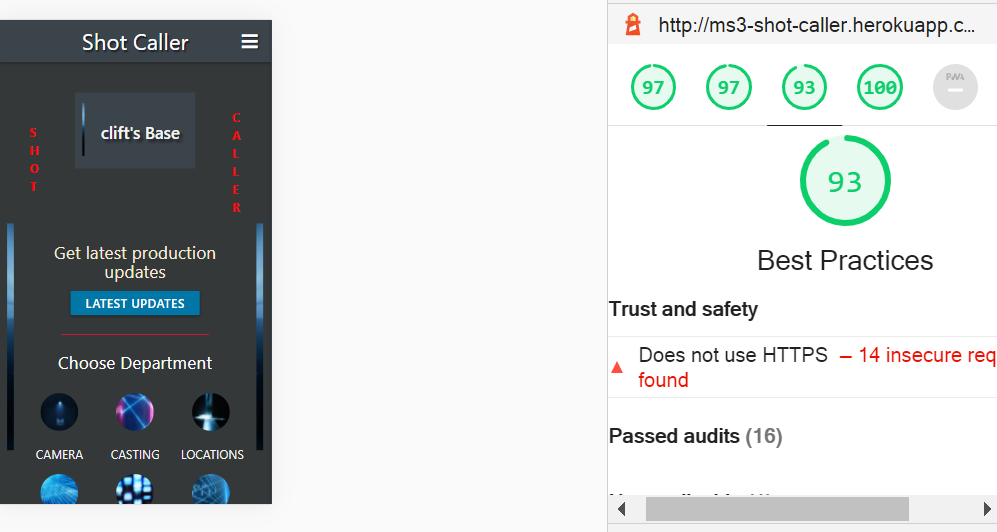
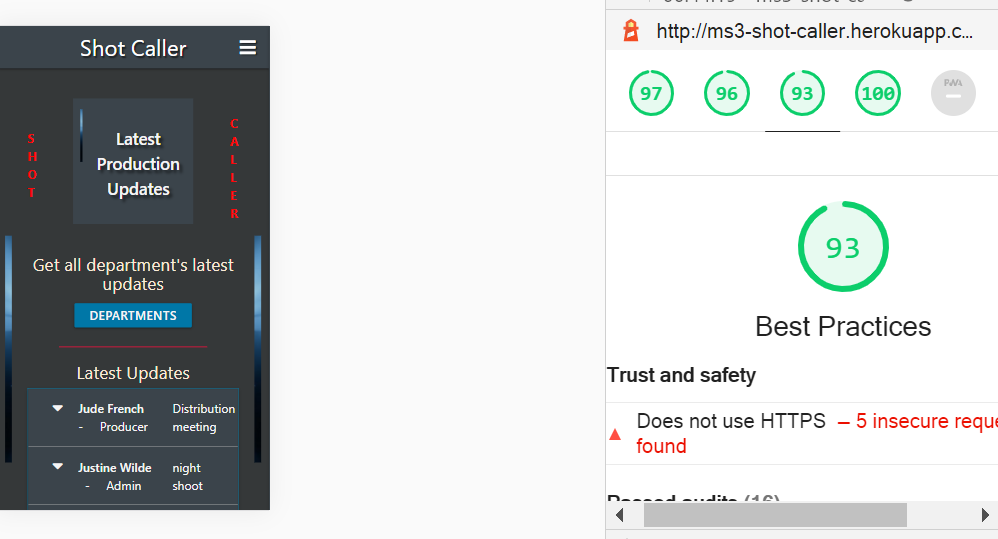

<h1 align="center"><strong>Shot Caller - Movie Production Website</strong></h1>

[View the project live here.](https://ms3-shot-caller.herokuapp.com/)

THIS IS THE DISPLAY VERSION OF THE APP. VIEW THE ORIGINAL REPO [HERE](https://github.com/johnston9/MS3-Shot-Caller)

A web application for film production that provides a comprehensive
means of production collaboration from pre-production to post-production. The app is designed 
to provide a simple streamlined means of communication through nine different 
departments channels. It allows both a general and specific 
means of searching and uploading communications including images to the different departments.

It has a secure admin facility for site regulation and the upkeep of the image
bank that includes a simple means of uploading the latest script, shot list. The site 
is built with Flask using the Jinja template engine and the Werkzeug WSGI toolkit
and uses MongoDB as the back-end database.

Future developments could lead towards the app being downloadable 
as a product to be used by production companies. At this stage, the app is being
deployed on Heroku's basic package, so HTTPS is only available for the Login and Register
pages.

<h2 align="center"></h2>

# Table of Content

- [User Experience (UX)](#user-experience--ux-)
  * [Strategy Plane](#strategy-plane)
  * [Scope Plane](#scope-plane)
  * [Structure Plane](#structure-plane)
  * [Skeleton Plane](#skeleton-plane)
  * [User stories](#user-stories)

- [Design](#design)

- [Existing Features](#existing-features)
  * [Responsive Design](#responsive-design)
  * [Login/Register Pages and Security Measures](#login-register-pages-and-security-measures)
  * [User Base Page](#user-base-page)
  * [Departments Page](#departments-page)
  * [Images Page](#images-page)
  * [Admin Page](#admin-page)

- [Database structure](#database-structure)

- [Languages Used](#languages-used)

- [Frameworks, Databases, Libraries & Programs Used](#frameworks--databases--libraries---programs-used)

- [Testing](#testing)

- [Lighthouse](#lighthouse)
  * [Summary of Issues](#summary-of-issues)
  * [Login page](#login-page)
  * [Register page](#register-page)
  * [User Base page](#user-base-page)
  * [Image page](#image-page)
  * [Departments page](#departments-page)

- [Testing User Stories from User Experience (UX)](#testing-user-stories-from-user-experience--ux-)
  * [First Time User Goals](#first-time-user-goals-1)
  * [Returning User Goals](#returning-user-goals-1)
  * [Frequent User Goals](#frequent-user-goals-1)
  * [Admin User Goals](#admin-user-goals-1)

- [Further Testing](#further-testing)
  * [Brute-Forcing Attacks](#brute-forcing-attacks)
  * [404 Error Handling](#404-error-handling)
  * [Login Page](#login-page)
  * [Register Page](#register-page)
  * [Logout](#logout)

- [Deployment](#deployment)
  * [Repository](#repository)
    + [Forking the GitHub Repository](#forking-the-github-repository)
    + [Making a Local Clone](#making-a-local-clone)
    + [Terminal](#terminal)
    + [Further steps required](#further-steps-required)

  * [Deploy to Heroku](#deploy-to-heroku)

- [Credits](#credits)

<small><i><a href='http://ecotrust-canada.github.io/markdown-toc/'>Table of contents generated with markdown-toc</a></i></small>

## User Experience (UX)

The business goals are to establish the app as a reputable and reliable tool
that facilitates film production. It provides a communication platform for all 
areas of film production allowing messages and images to be sent
through each department channel. A future goal would be the inclusion
of collaboratative areas, and storyboard and shot list imaging pre-visualization tools.

For the user, the goal of the app is to enhance and facilitate film production.
It will allow a simple reliable means of departmental and inter-departmental
communication. It is streamlined for the exchange of messages by specific areas.
It will allow the user to instantaneously share and receive 
ideas on all production related developments as they happen.

### Strategy Plane

The aim of the site is to create an app that facilitates film production and is on a par with the latest trends in digital communication media. It aims to be enjoyable and simple to use and become a “go to” tool in film production.
The site is designed to give the user, here being specifically the film production team, the necessary tools to communicate their ideas during production collaboration.  

Clearly separating the production process by department is key to the site’s simplicity and reliability of use where the user can fulfil their needs to find and post communications and images.
The owners of the site, here being the production team, have overall control over the site and the necessary tools, unique only to those given admin access, to update the script and the shot list and add and delete image in the image bank.
Security is a big factor in the site and only those give a key can register, the password functionality is secured through Werkzeug and the admin access id check both in the front and backend.

### Scope Plane

The features included in the app at present reflect choices made around the following reflections. 
What is absolutely necessary for the app to deliver it’s basic marketed functionality?
Which proposed features are buildable?
What features are necessary to make the app sellable? 
The buildable aspect was vital for the scope of the app and several more advance features, like a communal workspace and storyboarding facilities were repositioned as future features.

[Back to Table of Content](#table-of-content)

### Structure Plane

The site is structured so the user can navigate in an intuitive way through the different features, all pages keeping a uniformed consistency. 
The user is taken on a journey into the site, all elements being discoverable as they proceed along.
The User Base is central to the structure. Here the user is being visibly encouraged to
select a department or click on one of the other options available to them. When the user selects a department,
they are taken to that page and given several specific "find messages" choices they can follow.
They will see clear states of change when they interact with the features and be given clear feedback to assure them of their interactive success.
The information architecture is a tree structure allowing users to move through content quickly and simply becoming aware of the site’s inherent structure as they go. 

<h2 align="center">

</h2>

### Skeleton Plane

The interface is aesthetically functionally all the time creating a positive reaction in the user with every click, 
making the user feel both at home here and part of an exciting journey. Details of
this are found in the Design section.

[Back to Table of Content](#table-of-content)

### User stories

 - #### First Time User Goals

1. As a First Time User, I want to learn what the site has to offer and how to use the site quickly.
2. As a First Time User, I want to find communications in my or other departments.
3. As a First Time User, I want to view images.

  - #### Returning User Goals

4. As a Returning User, I want to download the latest shot list and script.
5. As a Returning User, I want to add a communication in a specific area.

  - #### Frequent User Goals

6. As a Frequent User, I want to view the latest production updates.
7. As a Frequent User, I want to edit and delete my communications.

8. As a Frequent User, I want to view and post communications relating to style and shooting choices.

  - #### Admin User Goals

1. As the admin user I want to upload the latest draft of the script.
2. As the admin user I want to upload the latest shot list.
3. As the admin user I want to upload new images.
4. As the admin user I want to edit images.
5. As the admin user I want to delete images.
6. As the admin user I want to delete a user.
7. As the admin user I want control over material posted on the site for legal
   and other purposes.

[Back to Table of Content](#table-of-content)

## Design

<h2 align="center">

</h2>

### Colour Scheme
 - The site aims to be minimal streamlined and slick using an off-black background 
   colour with blue side image panels and an off-white text. Crimson and blue tones
   are used minimally against this for a touch of sophisticated flare especially
   the site title in crimson letters running downwards on either side of the header box.

  
### Typography
 - Materialize was used for the site and I kept their inherent font-family style 
   choice with was: -apple-system, BlinkMacSystemFont, "Segoe UI", Roboto, 
   Oxygen-Sans, Ubuntu, Cantarell, "Helvetica Neue", sans-serif. This worked perfectly
   for the style of the site.

### Imagery
 - The site was designed to have a minimal straight to business slick slightly cinematic look. For this
   two narrow side panels containing a right and reversed left image of a cinematic lighting effect were placed on an off-black background.
   The images of a window filtering in blue lighting act as a foreground to the dark header box that contains a small version of the left image.
   and to which focus is drawn. The hope is that
   this achieves a feeling of cinematic lighting and depth.

### Wireframes

 - PDF – Balsamic was used to design the layout for login, register, user base, 
   department messages, images, and the add and admin pages.

   [View on Github](https://github.com/johnston9/MS3-Shot-Caller)

[Back to Table of Content](#table-of-content)

## Existing Features

### Responsive Design

  The site is responsive to all sizes and the images remain whole and in proportion at all sizes.

 <strong>Small Screen 370px</strong>

<h2 align="center">

</h2>

[Back to Table of Content](#table-of-content)

### Login/Register Pages and Security Measures

  The user is brought first to the login page. From there they will find a 
  link to the Register page. The site has a number of security measures.

  The first of which is the need for a register key to register. This will allow
  the owner of the site control over who is able to register. It would then be up to 
  them to give the necessary instructions to the user to ensure that the key is not 
  further passed on. 

  As a minor security feature the login and register pages are not connected to the base
  page and the other pages.

  Werkzeug's security utilities "generate_password_hash" and "check_password_hash"
  are used on the register and login functions and ensure login security.
 
  Other security measures include front end measures to allow admin access only to admin.
  This is backed up in the back end ensuring only these admin functions will run if
  admin is the session  user.

  All other functions in the back end are protected by ensuring that there is a session 
  user for them to run, and only registered users would be logged in and set as session  users.

<strong>Register Page</strong>

<h2 align="center">

</h2>

 See Further Testing login and register pages.

 - [Back to Table of Content](#table-of-content)

### User Base Page

  Once logged in the user is taken to their own User Base page which is the central hub
  of the site and, along with all other pages, has a navbar to take them to any page on the site.
  They will immediately see a "Latest Updates" button which they can click on to take
  then directly to a page showing the latest production messages. This in intended as a primary
  feature of the app allowing all crew members to stay on top of current developments.

<strong>Latest Updates</strong>

<h2 align="center">

</h2>

  The bulk of the page is used to show the different departments on which the user can
  click to view each department's communications. 
  Central to the site is clarity and specificity. The first measure of this is the 
  separation of all the production communications into nine departments.

  This page also allows the user to download the latest script and shot list, to add messages 
  and provides a link to take them to the images page.

<strong>User Base Department Choices</strong>

<h2 align="center">

</h2>

[Back to Table of Content](#table-of-content)

### Department Messages Pages

  Once the user clicks on a department they are taken to that department's 
  Find by Date Page. That day's communications or messages will automatically be displaying.
  All messages open on click to reveal the contained message and any images in
  it.
  

<strong>Today's Messages</strong>

<h2 align="center">

</h2>

  The user can then search further and find messages by specific date by using the Datepicker.

<strong>Pick Date - on mobile</strong>

<h2 align="center">

</h2>
 
  Underneath the Datepicker the user has three further options in the form
  of three immediately visible buttons.

  A. Finding all messages in that department.

  B. Add a message.

  C. Find messages by Poster. This button takes the user to a separate Find by Poster Page where they
  can find communications by entering the poster's name. 

<strong>Find by Poster Page - message open</strong>

<h2 align="center">

</h2>

[Back to Table of Content](#table-of-content)

### Images Page
    
  The user here can find images by entering a specific image tag name if they have 
  it or entering a search word relating to the images they wish to see. These images
  are only upload by admin so they are intended to be actual style and shooting choices,
  or options of these. Users have the option to post their own images in department
  messages. If any of these are to be used for the main image bank all the admin can 
  right click on it and add the URL in the Upload Image page that only they have
  access to.

<strong>Images Page</strong>

<h2 align="center">

</h2>

 If no image is found for a query a message is displayed.

<h2 align="center">

</h2>

### Add Message Page
 
 - In Add Message users can post messages and include an image in their message.
   They are given instructions on how to obtain an image SRC. They are instructed 
   just below the Enter Image title that they must fill in the image name box if they
   enter an image SRC as alt can use this. 
   They are also instructed to use the image check button to ensure that the URL is correct. 
   Please see user testing for further details.

<h2 align="center">

</h2>

### Edit Message Page
 
 - Users can edit their own messages. The Edit and Delete buttons will only display under their
   messages for them and admin, who has access to all messages. In Edit Message they can edit 
   their message. They can also add an image to their message, change the images or it's name.
   They are given the same instructions as in Add Message. 
   Please see user testing for further details.

[Back to Table of Content](#table-of-content)

### Image Checker

  As the users and admin upload images using a URl from Cloudinary or a similiar site
  all pages where this is done have an image checker. That is the Add and Edit Message
  pages for the user and the Add and Edit Images for the admin. See Further Testing section
  for more images.
  

<strong>Add Message Page- Image OK</strong>

<h2 align="center">

</h2>

### Admin's Base Page

  As discussed above in "Security Measures" defensive programming will only allow
  access to the admin features if admin is the session user and this is implemented 
  both in the front-end and back-end. If the user is admin four buttons are displayed
  on their home base page. These will be given the 
  option to delete a user, upload the latest script, upload the latest shot list 
  or upload new images. Edit and delete buttons also display for them under all 
  messages and images. When the admin goes to the Add/Edit Image and Message pages they will also
  be able to use the Image Checker there.

<strong>Admin Page 1600px</strong>

<h2 align="center">

</h2>

<strong>Admin Page 375px</strong>

<h2 align="center">

</h2>

Please see admin testing for further details.

[Back to Table of Content](#table-of-content)

## Database structure

MongoDB was used as the site's database and held 14 collections. 

1 - <strong>latest_script</strong> - to hold the script URL.

2 - <strong>shotlist</strong> - to hold the shot list URL.

3 - <strong>users</strong> - to hold the user's details.

4 - <strong>images</strong> - to hold the image bank images ref names, descriptions and URLs.

5 - <strong>depts</strong> - to hold the departments names, titles and the department images URLs for User Base/Department's pages.

6-14 - <strong>9 collections</strong> for each of the departments' messages.

There is an Entity Relationship between the users collection and the 9 separate departments
collections on "username" and "job_title". A third relationship
is between the concatenated result of the users collection "firstname" and "lastname" attributes
values and the department collection's "poster" attribute. These allow the automatic input 
of these user values when a user sends a message.

There is an Entity Relationship between the depts collection and the 9 departments collection on depts dep_name and
the actual name of each of the department collections. This allow for the
depts dep_name to be passed to app.py when a department is clicked on in the User
Base or Departments page. This sends dep_name as a variable to the get_dep function in app.py allowing
it to be used in the find() method on Mongo and get the messages for the collection of that name.

<strong>Note 1:</strong> In the ER Diagram the last relationship above points to the dep_name in the example camera
      collection as it was not technically possible to have it point to the collection name, which
      is in fact the correct relationship.

<strong>Note 2:</strong>: Only one, "camera", of the 9 department collections is used in the diagram but the same
      relationships exist for all 9 department collections.

<strong>Note 3:</strong> Two values in the images collection, image_name and image_src, share the same names as ones
      in the department collection but this is not actually used by any python function. If admin 
      wants to use one of the message images they would do so manually on the spot by right clicking on it.
      Also, they may wish to alter the image_name for various reasons.

<h2 align="center">

</h2>

[Back to Table of Content](#table-of-content)

The MongoDB Shot Caller database contains the following collections.

 <strong>users</strong>- for user details

<h2 align="center">

</h2>

<strong>depts</strong>- for each department's details

<h2 align="center">

</h2>

<strong>9 department collections, e.g., camera</strong> - each containing that department's messages

<h2 align="center">

</h2>

<strong>images</strong> - for image details

<h2 align="center">

</h2>

<strong>shotlist</strong> - for the shot list's URL

<h2 align="center">

</h2>

<strong>script</strong> - for the script's URL

<h2 align="center">

</h2>

[Back to Table of Content](#table-of-content)

## Languages Used

- [HTML5](https://en.wikipedia.org/wiki/HTML5)
- [CSS3](https://en.wikipedia.org/wiki/Cascading_Style_Sheets)
- [JAVASCRIPT](https://en.wikipedia.org/wiki/JavaScript)
- [PYTHON](https://en.wikipedia.org/wiki/Python_(programming_language))
- [JINJA](https://en.wikipedia.org/wiki/Jinja_(template_engine))

## Frameworks, Databases, Libraries & Programs Used

1. [Materialize:](https://materializecss.com/getting-started.html)
   - Materialize with it's grid-based 
     format was used to create the overall framework for the site This included the primary responsiveness
     and overall styling of the website. Also specific 
     Materialize features, which include the "Collapsible", 
     the "Navbar" and "Sidenav", "Modals", "Tooltipped" and "Datepickers", were used in the site,.
1. [Flask:](https://en.wikipedia.org/wiki/Flask_(web_framework))
   - Flask was used along with python to build then site's back end framework and
     run the app.
1. [Werkzeug:](https://werkzeug.palletsprojects.com/en/1.0.x/)
   - Flask used Werkzeug to the application to speak with the webserver and 
     for security purposes mainly with regard to the users' password.
1. [Jinja:](https://en.wikipedia.org/wiki/Jinja_(template_engine))
   - Flask used the Jinja template engine to build the front end of the app.
1. [MongoDB:](https://en.wikipedia.org/wiki/MongoDB)
   - MongoDB was used as the app's back 
   end database.
1. [Pymongo:](https://pypi.org/project/pymongo/)
   - Pymongo was used for interacting with MongoDB database from the app.
1. [Font Awesome:](https://fontawesome.com/)
   - Font Awesome was used throughout the website for the icons.
1. [jQuery:](https://jquery.com/)
   - jQuery was used along with Javascript to initialize the Materialize features.
1. [Git](https://git-scm.com/)
   - Git was used for version control by utilizing the Gitpod terminal to commit to Git and Push to GitHub.
1. [GitHub:](https://github.com/)
   - GitHub is used to store the projects code after being pushed from Git.
1. [Balsamiq:](https://balsamiq.com/)
   - Balsamiq was used to create the [wireframes](https://github.com/johnston9/MS3-Shot-Caller) during the design process.
1. [Freeformatter](https://www.freeformatter.com/html-formatter.html)
   - Freeformatter was used to tidy up the final code.
1. [Gauger](https://gauger.io/fonticon/)
   - Gauger was used to create the favicon icon.
1. [Am-I-Responsive](http://ami.responsivedesign.is/):
   - Am I Responsive was used to test the site's responsive sizings and to generate responsive sizing images.
1. [GitHub Wiki TOC generator:](http://ecotrust-canada.github.io/markdown-toc/)
   - GitHub Wiki TOC generator was used to create the Table of Contents.
1. [dbdiagram.io](https://dbdiagram.io/home)
   - dbdiagram.io was used to create the Entity-Relationship Diagram.

[Back to Table of Content](#table-of-content)

## Testing

W3C Markup Validator, W3C CSS Validator. PEP8 and JSHint were used to validate every page of the project.

- [W3C Markup Validator](https://validator.w3.org/) - [Results](https://github.com/johnston9/MS3-Shot-Caller)
  - W3C "Direct Input" option was used on each html page. As Jinja was used throughout the site
    errors displayed where it was used on each page - documentation/w3c-direct-input.
    When I validated by URL no errors were shown - documentation/w3c-by-url.

- [W3C CSS Validator](https://jigsaw.w3.org/css-validator/#validate_by_input) - [Results](https://github.com/johnston9/MS3-Shot-Caller)
  - W3C showed no errors and only one warning for the hr rule's background color
    being the same as it's color, but this was intentional.
  
- [JSHint](https://jshint.com/) - [Results](https://github.com/johnston9/MS3-Shot-Caller)
  - JSHint was used with "New JavaScript features (ES6)" and "jQuery" checked in the configuration menu.
    All clear apart from one unused variable message for "check_image" but the function,
    is called from the page onclick.
    
- [PEP8 online check](http://pep8online.com/) - [Results](https://github.com/johnston9/MS3-Shot-Caller)
  - PEP8 approved the app.py page. The first time I checked it everything was right apart from saying "no newline at end of file".
    but I researched this and found it was a common result and could be ignored. I explored the matter more and found that if
    the curser was at the start of the new line, here line 738, I got an "All Right" result.

- [PythonChecker](https://www.pythonchecker.com/) - [Results](https://github.com/johnston9/MS3-Shot-Caller)
  - PythonChecker gave 100% result.

[Back to Table of Content](#table-of-content)

## Lighthouse

Lighthouse was used to test every page in desktop and mobile screens.

### Summary of Issues 

1. On all pages apart from the Login and Register "Not Secure" displayed in the address 
   and Best Practices had a "Does not use HTTPS - insecure requests found" error. 
   This is because I was using basic Heroku and can fix this if I purchase an SSL certificate.

<strong>Does not use https message</strong>

<h2 align="center">

</h2>

2. Lighthouse gave me an accessibility note for the header "Shot Caller" decorative
   writing in red either side of the header box. As this is purely decorative and is only barely visual limited I left it
   red as this was in keeping with my style intentions. I did however change it from Crimson
   to a bright red. See User Base page - Accessibility below for more on that issue.

3. On the User Base and Departments pages Lighthouse gave me a Best Practices messages 
   regarding the image sizes. See User Base page below for more on that issue.

4. Lighthouse gave me an accessibility note for the select dropdown trigger on the Add Message page
   and the Edit Message page for not having a label. There is a label seen for select itself so in using Materialize I am aware
   this issue will occur.
   See Add Message page below for more on that issue.

5. Lighthouse gave me a Best Practices report for SameSite cookie for the Image page
   and the Latest Updates page and the Department messages pages if they contained images. This was because I was using
   Cloudinary to get the images. The SameSite cookie will be addressed at a further stage
   if the site is to develop further.
   See Image page below for more on that issue.

### Issues Resolved

1. On first report Lighthouse gave me an accessibility note for the sidenav icon not having a name or label.
   I added 'aria-label="Menu"' and the issue was resolved.

2. On first report Lighthouse gave me an insecure link warning for the link to Cloudinary 
   I put rel="noopener" in all links and the issue was resolved.

3. Lighthouse gave me a Best Practices report for the department message pages and the Images page 
   saying Browser errors were logged to the console when an image is not found. 
   To deal with this I firstly added an image URL checker for the admin Add Images page
   and for the Add Message page so the user can make sure they submit a correct URL.
   Secondly, in case something does cause an image loading error or somehow an incorrect
   URL did get submitted I added an inline onerror check to display default message images instead of the generic little
   green square. For the message pages the message image tells the poster they should check the URL. On the image page
   the default image just says "Available Soon" which will let admin know to fix it without
   letting anyone being acutely aware of any error. Still an error will log to the 
   console, but all users will be aware of what is happening and what to do. See Known 
   Bugs below for images.

### Login Page

On first report Lighthouse gave me an accessibility note for the submit button and 
register link, but I changed the colours and the issue was resolved. Desktop and mobile
results the same.

<strong>Desktop</strong>

<h2 align="center">

</h2>

### Register Page

As above same result for desktop and mobile. 

<strong>Desktop</strong>

<h2 align="center">

</h2>

[Back to Table of Content](#table-of-content)

### User Base Page 

 - #### Best Practices
On first report Lighthouse gave me a Best Practices note for images not being sized with the correct aspect ratio. I resized
the images to the desire 2:3 ratio and at desktop this was no longer an issue. Below is an image detailing the Best Practices
with only the HTTPS error common to all pages.

<strong> User Base page</strong>

<h2 align="center">

</h2>

 - Mobile

I also resized the images to the desired 50px by 50px for mobile devices but the only way I could
use them with the Jinja Template was to create two img elements in the for loop code block
and set one to display "none" at larger than 600px in CSS and the opposite for the other. I decided against doing this weighing 
the slight improvement  in Best Practices and the improvement  in Performance against cleaner, shorter code
minimizing any risk no matter how small.
That said should the app the taken to a further stage I will investigate it more.
Below is an image for mobile that still has the Best Practices image size issue.

<strong> Mobile result</strong>

<h2 align="center">

</h2>

[Back to Table of Content](#table-of-content)

 - #### Accessibility

Lighthouse gave me an accessibility note for the header "Shot Caller" decorative
writing in red either side of the header box. As this is purely decorative and is only barely visual limited I left it
red as this was in keeping with my style intentions. I did however change it from Crimson
to a bright red.

This report was for every page on the site and accounted solely for the "97" score that
was given for "Accessibility" on this and all other pages apart from Add Message. I will include 
the image here that would be similar for all pages.

<strong>Header red text note</strong>

<h2 align="center">

</h2>

 - The extra buttons on the admin user page did not affect the results.

 [Back to Table of Content](#table-of-content)

 - ### Departments Page

The Departments page had the same results as the User Base page for the Best Practices issue.

<strong>Desktop</strong>

<h2 align="center">

</h2>

<strong>Mobile</strong>

<h2 align="center">

</h2>

 - ### Add Message Page

As regards the label issue above I tried to use "aria-label="Select Department"
but as expected it had no result as the dropdown is not reachable on the page.

<strong>Desktop</strong>

<h2 align="center">

</h2>

 - ### Edit Message Page

The Edit Message page had the same result and issue as the Add Message page.

<strong>Desktop</strong>

<h2 align="center">

</h2>

Both pages had same result for mobile.

<strong>Edit Page Mobile</strong>

<h2 align="center">

</h2>

[Back to Table of Content](#table-of-content)

 - ### Department Messages Pages

The department message pages got a SameSite cookie issue for the Best Practices
along with the HTTPS issue.

<strong>Desktop with no Images in Messages</strong>

<h2 align="center">

</h2>

<strong>Desktop with Images in Messages</strong>

<h2 align="center">

</h2>

<strong>Mobile with Images in Messages</strong>

<h2 align="center">

</h2>

 - ### Images Page

The Images page got a SameSite cookie issue for the Best Practices
along with the HTTPS issue.

<strong>Desktop</strong>

<h2 align="center">

</h2>

<strong>Mobile</strong>

<h2 align="center">

</h2>

 - ### Latest Production Updates page

 Without images in the messages Best Practices only gave the HTTPS issue.

<strong>Desktop</strong>

<h2 align="center">

</h2>

 - ### Admin pages  

All 4 admin pages had the same results for desktop.

<strong>Remove User page</strong>

<h2 align="center">

</h2>

All 5 admin pages had the same results for mobile.

<strong>Add Latest Script page</strong>

<h2 align="center">

</h2>

<strong>Add Image page</strong>

<h2 align="center">

</h2>

<strong>Edit Image page</strong>

<h2 align="center">

</h2>

### Lighthouse robot.txt once off issue

1. Lighthouse gave me an error for the robot.txt not being valid one time
   but never again.  
    

<strong>Robot.txt warning</strong>

<h2 align="center">

</h2>

[Back to Table of Content](#table-of-content)

## Testing User Stories from User Experience (UX) 

### First Time User Goals

1. #### As a First Time User, I want to learn what the site has to offer and how to use the site quickly.

    1. The site is designed for first time learning. It is streamlined for specific
       user goals that after first use are so simple that with a few clicks after entering
       the site the user will be able to get to any specific area or tool. At the top of the 
       User Base Page and throughout the site the navbar displays all options for the user
       so they can select their desired destination quickly.
    2. Upon entering the user is taken to their home base and greeted with image
       links for each production department and the message to "Choose Department".
       Upon clicking on a department, they are taken to that department's "Find by Date Page"
       where that day's communications are automatically showing.
       They are given further choices to find all messages or go to the "Find by Poster Page".
       The user will become automatically aware of what is on offer and how to find a particular
       field with a few clicks. The user will see the choices on offer and learn how best 
       to use them for their needs.
    3. Below the departments on the User Base Page the user will see further options
       to add messages, search images, download the script or download the shot list.

<strong>User Base</strong>
   
<h2 align="center">

</h2>

2. #### As a First Time User, I want to find communications in my or other departments.

    1. Upon clicking on a department, the user is taken to the "Find by Date" page
       where that day's messages automatically display.
       They will see a form at the top allowing them to find messages 
       by a particular date.
    2. Below that are three buttons, the first to find all messages. 
       The second to add a message.
    3. The third button will offer a further option to go to "Find messages by Poster" page. 
    5. On clicking this button the user will be taken to the "Find messages by Poster Page" where they can get all messages
       from a particular team member by typing in their full name as instructed.
    6. In the actual messages container, each message displays the name and position
       of the poster, the subject and whether it is a priority or not in the header. On clicking on a message box
       it will open to show the message and an image if one has been posted.

<strong>Departments</strong>

<h2 align="center">

</h2>

3. #### As a First Time User, I want to view images.

    1. In the navbar and on their home base the user will see a link to search images
       which on clicking will take them to the images page.
    2. The user will see instruction on how to search for images. They can use a specific
       image reference tag, if they have one or they can input search words relevant
       to what they are looking for.
    3. The image bank is uploaded by the production team only so only contains sanctioned
       images of style choices, locations and other images all in keeping with the choices
       set by the team or different options that are being worked on or considered.

<strong>Specific reference tag input</strong>

<h2 align="center">

</h2>

<strong>Specific reference tag result</strong></strong>

<h2 align="center">

</h2>

<strong>Result for query word "nick"</strong>

<h2 align="center">

</h2>

[Back to Table of Content](#table-of-content)

### Returning User Goals

4. #### As a Returning User, I want to download the latest shot list and script.

    1. On clicking download script the script is downloaded to the user's device.

    1. On clicking download shot list the shot list is downloaded to the user's device.

<strong>Result for downloaded shot list</strong>

<h2 align="center">

</h2>

<strong>Result for downloaded script</strong>

<h2 align="center">

</h2>

5. #### As a Returning User, I want to add a communication in a specific area.

    1. In the navbar, on the User's Base page and in all the department
       pages the user will see a button to "Add Message". 
    2. On clicking the button, the user is brought to the "Add Message" page
       where they can post a new communication. A flash message will display
       if their message has been added successfully.
    3. They are also given the option to add an image and instructions on how to do 
       so are supplied. 

<strong>Add message page</strong>

<h2 align="center">

</h2>

<strong>Result</strong>

<h2 align="center">

</h2>

[Back to Table of Content](#table-of-content)

### Frequent User Goals

6. #### As a Frequent User, I want to view the latest production updates.

   1. When the user clicks on the Latest Updates button on their home base page they are taken to the
      Latest Production Updates Page to do just that.
      There is also a link to take them straight to all other departments.

  

<strong>Latest Updates Page</strong>

<h2 align="center">

</h2>

7. #### As a Frequent User, I want to edit and delete my communications.

    1. The user will have edit and delete buttons display under the messages that they themselves have
       posted. Only they and admin will have these display.
    2. With a click they will be taken to the "Edit Message" page where they can edit their message.
       They will get a flash message to tell them if the edit was a success.

<strong>Message before edit</strong>

<h2 align="center">

</h2>

<strong>Edit page</strong>

<h2 align="center">

</h2>

<strong>Flash message</strong>

<h2 align="center">

</h2>

<strong>Message after edit</strong>

<h2 align="center">

</h2>

3. On clicking the delete button the user will be given a modal warning asking if they are sure
       they want to delete the message and a flash message telling them if the 
       delete was a success should they click OK.

<strong>Delete Modal</strong>

<h2 align="center">

</h2>

<strong>Flash Message</strong>

<h2 align="center">

</h2>

8. #### As a Frequent User, I want to view and post communications relating to style and shooting choices.

   1. After first use the user will be easily able to navigate
       through the approved to locate desired fields of messages by date, department and Poster. 
   2. After first use the user will be easily able to post all communications
       and images.
   3. After first use the user will be easily able to download the script
       and shot list. 

### Admin User Goals

1. #### As the admin user I want to upload the latest draft of the script.

   - If the admin user clicks the upload script button available only to them they
     will be taken to the "Add Latest Script" page. They can follow the instructions
     telling them how to upload and get an SRC for the new file from Cloudinary, 
     or a similar app, and enter an SRC here.
     
<h2 align="center">

</h2>

- They will get a flash message to tell them if it was successful. 

<h2 align="center">

</h2>

2. #### As the admin user I want to upload the latest shot list.

   - If the admin user clicks the upload shot list button available only to them they
     will be taken to the "Add Latest shot list" page. They can follow the instructions
     telling them how to upload and get an SRC for the new file from Cloudinary, 
     or a similar app, and enter an SRC here.
     
<h2 align="center">

</h2>

- They will get a flash message to tell them if it was successful. 

<h2 align="center">

</h2>

3. #### As the admin user I want to upload new images.

   - If the admin user clicks the upload images button available only to them they
     will be taken to the "Add New Images" page. They can follow the instructions
     telling them how to upload and get an SRC for the new file from Cloudinary, 
     or a similar app, and enter an SRC here. They will also be told that if they
     want to use an image already uploaded by a user in the department messages they
     can right click on the image and enter it here. They can also click on the
     "Check Image" button to ensure the URL is correct. They will get a flash message 
     to tell them if it was successful. See "Further Testing - Image Checker" for 
     images.
     
<h2 align="center">

</h2>

4. #### As the admin user I want to edit images.

   - On the images page under every image an edit button will display for
     the admin and the admin only. 

<h2 align="center">

</h2>
          
   - On clicking it they will be taken to the
     "Edit Image" page where they can update any of the three image values
     and again check the new image URL.
     
<h2 align="center">

</h2>

- They will get a flash message to tell them if it was successful.

<h2 align="center">

</h2>

5. #### As the admin user I want to delete images.

   - On the images page under every image a delete button will display for
     the admin and the admin only. On clicking they will be given a modal
     asking them to confirm. On doing so they will get a flash message.

- They will get a flash message to tell them if it was successful.

<h2 align="center">

</h2>

6. #### As the admin user I want to delete a user.

   - If the admin user clicks the "Remove User" button available only to them they
     will be taken to the "Remove User" page. They must enter the user's firstname in one box
     then user's lastname in another, then press submit. They will get a flash message on
     completion. No modal use deemed necessary as this is an already involved process.

- They will get a flash message to tell them if it was successful.

<h2 align="center">

</h2>

7. #### As the admin user I want control over material posted on the site for legal and other purposes.

   - Admin will have access to the edit and delete functions for every message on the site. 
     This along with the "Remove User" function will give admin full control of the site.

## Further Testing

### Brute-Forcing Attacks

- If a user tries a brute-force entry using a known user's username with the Base Page URL
  they will get an Internal Server Error message.

<h2 align="center">

</h2>

- If a user tries a brute-force entry using;  
  1. A known view, e.g., /get_image. 
  2. A view that takes an argument but without the argument, e.g., /get_dep. 
  3. A view that takes an argument with a correct argument, e.g., get_dep/camera.  
  they will get an Internal Server Error message.
  
<h2 align="center">

</h2>

- If a user tries a brute-force entry using any other characters after the address
  they will get an Internal Server Error message.
<h2 align="center">

</h2>

### 404 Error Handling

- If a user is logged in as a session user and they get a 404 error they will be directed to a custom page
  with a link back to their home base page. This page was built without 
  a favicon link or any metadata intentionally.

<h2 align="center">

</h2>

### 500 Error Handling

- If a user is logged in as a session user and they get a 500 error they will be directed to a custom page
  with a link back to their home base page. This page was built without 
  a favicon link or any metadata intentionally.

### Login Page
 
 - If user's "Username" entry does not match the requested format they get a warning message.

<h2 align="center">

</h2>

 - If user's "Password" entry does not match the requested format they get a warning message.

<h2 align="center">

</h2>

- If user's "Username" or "Password" do not match to ones stored on the database 
   they get a flash "Incorrect Entry" message.

<h2 align="center">
s
</h2>

### Register Page
 
 - If user's "Username" entry does not match the requested min length format they get a warning message.

<h2 align="center">

</h2>

 - If user's "Username" entry does not match the requested character format they get a warning message.

<h2 align="center">

</h2>

 - If user does not fill in the required "First Name" field they get a warning message.

<h2 align="center">

</h2>

 - If user does not fill in the required "Last Name" field they get a warning message.

<h2 align="center">

</h2>

 - If user does not fill in the required "Job Title" field they get a warning message.

<h2 align="center">

</h2>

 - If user's "Password" entry does not match the requested character or length format they get a warning message.

<h2 align="center">

</h2>

 - If user does not enter a key they get a warning message.

<h2 align="center">

</h2>

 - If user enters an incorrect key they get a flash "Invalid Key" message.

<h2 align="center">

</h2>

### Image Checker

  This allows users and admin to ensure they have inputted a correct URL for they user
  when they upload or edit a message and for admin when they upload or edit 
  an image for the image bank.
  

<strong>Add Message Page - Image Incorrect</strong>

<h2 align="center">

</h2>

<strong>Add Image Page - Image Incorrect</strong>

<h2 align="center">

</h2>

<strong>Add Image Page - Image OK</strong>

<h2 align="center">

</h2>

### Logout

The logout button removes the user from session user and displays a Flash message if this is
sucessful.

<h2 align="center">

</h2>

[Back to Table of Content](#table-of-content)

### Known Bugs

- On my laptop the select department
  input box red line warning on the add message page remains red after a department is selected.
  On all other devices that the app was tested on, including those of a number of tutors, who I check the issue with, it turns green
  as it is meant to do. Example below of it working correctly.

<h2 align="center">

</h2>

- If a user uploads an incorrect URL despite the instructions to use the Image Checker the image will not render
  when an attempt to display the image occurs.
  I have set, by inline onerror code, default images to display instead. These advise the user about the issue.
  I also have set aria labels with the same messages as the default images for screen readers.
  I'm noting this as a bug because and an error will still log to the console.

<strong>Images page</strong>

<h2 align="center">

</h2>

<strong>All message pages</strong>

<h2 align="center">

</h2>

#### Bug Fixed

- As the alts for all message images are taken from the user's image name input if the user 
  does not supply one as instructed there would be no alt. To make sure all image have alts
  I used an if/else statement to have one code block run if there is an image name
  another to run if not that will set a generic default alt.
  

### A Code Note

For the add_script function I got the object_id for the original document to be updated
by having Flask get the Mongo latest_script collection, passing that to the Jinja template
so it could get the id and pass that back to the Flask as an argument.

For the add_shotlist function I just set the object_id for the document directly in
the function.

The reason for this is just to have options in further developments of the app as to which
method would be most appropriate.

[Back to Table of Content](#table-of-content)

## Deployment

### Development platform

1. [Gitpod:](https://www.gitpod.io/docs/)
   - Gitpod was used as the development platform.

### Repository
   [Github](https://github.com/)
   - Github was used as the repository for the project.

#### Forking the GitHub Repository

By forking we make a copy of the GitHub Repository in our Github account.

1. Log in to GitHub and locate the [GitHub Repository](https://github.com/johnston9/MS3-Shot-Caller)
2. At the top of the Repository just above the "Settings" button on the menu, click the "Fork" Button.
3. This will create a copy of the original repository in your GitHub account.

#### Making a Local Clone

1. Log in to GitHub and locate the [GitHub Repository](https://github.com/johnston9/MS3-Shot-Caller)
2. Under the repository name, click "Code" beside the Gitpod button.
3. To clone the repository using HTTPS, under "Clone with HTTPS", copy the link.
4. Open Git Bash.
5. Set the current working directory to the location where you want the cloned directory to be made.
6. Type git clone, and then paste the URL copied above.
7. Press enter and a local clone will be created.
8. You may want to unpack the everything from the containing "MS3-Shot-Caller" folder.
9. The clone will include two files needed for set up and Heroku.
   -  The requirements.txt file which contains all packages to be installed to run the app. These are  
      Flask-PyMongo, dnspython and Flask and it's dependencies. Heroku
      will need these to run the app.
   -  The Procfile which tells Heroku what language the app is using.

Click [Here](https://help.github.com/en/github/creating-cloning-and-archiving-repositories/cloning-a-repository#cloning-a-repository-to-github-desktop) to retrieve pictures for some of the buttons and more detailed explanations of the above process.

#### Terminal

  - Use the following command to install the packages needed for the app from 
    requirements.txt. 

##### pip3 install -r requirements.txt 
  - The -r switch tells pip to install packages from the requirements.txt file 
    needed for the app.

#### Further steps required  

Some files containing sensitive variables will not have been pushed to Github so it 
will be necessary to create them.

##### Create a .gitignore file
- .gitignore is used to store sensitive variables and keys that do not get sent to github.
  Type pycach.py and env.py in the .gitignore file.

##### Create a env.py file 
- Type touch env.py in the terminal.
  In env.py set the app's environment variables and keys needed during development.
  These will later be set in Heroku.

    **env.py**

      import os

      os.environ.setdefault("IP", "0.0.0.0")

      os.environ.setdefault("PORT", "5000")

      os.environ.setdefault("SECRET_KEY", "***************")

      os.environ.setdefault("REGISTER_KEY", "************")

      os.environ.setdefault("MONGO_URI", "Get this in Mongo when you click 
      'Connect your Application’ after clicking the Connect button")
      
      os.environ.setdefault("MONGO_DBNAME", "The name of your Mongo database") 

### Deploy to Heroku

[Heroku](https://www.heroku.com/platform)

#### Heroku was used to deploy the project.

 - As mentioned in the "Clone" section above a requirements.txt and Procfile are needed
by Heroku to run the app. If not already created make sure to do so. In the terminal
type the following commands.

   - pip3 freeze --local > requirements.txt
   - echo web: python3 app.py > Procfile

 - Register a Heroku account.

 - Click 'Create a New App'.

 - Where asked select "Europe" as the region then click create app.

 - Click Settings then click Reveal Config Vars.

 - Now set the variables and keys to those in env.py.

     - IP, with the value of 0.0.0.0.

     - PORT, which is 5000.

     - SECRET_KEY, copy then paste it from env.py. 

     - REGISTER_KEY, ************

     - MONGO_URI, get this when 'Connect your Application’ is clicked on in Mongo connect area.

     - MONGO_DBNAME, The name of your Mongo database.

- THEN CLICK HIDE CONFIG VARS

 - Back in Deploy choose Github then click Search to get the correct Github repo for the app
   then click connect.

 - Click Enable Automatic Deployment then click Deploy Branch.

 - Click "View" to launch the app.

### Clarification

Clarification on steps taken in the terminal to create the app using pip3 
to install packages without requirements.txt and how to create the Procfile. 

##### pip3 install Flask

##### pip3 install flask-pymongo
- So Flask can communicate with Mongo install 'flask-pymongo'.

##### pip3 install dnspython
- Install 'dnsython' in order to use the Mongo SRV connection string.

##### echo web: python app.py > Procfile
- This tells Heroku what language the app is using.

##### 6. pip3 freeze --local > requirements.txt
- A requirements.txt containing all Flask dependencies is needed for Heroku to run the app.

[Back to Table of Content](#table-of-content)

## Credits

### Code

- [W3schools.com](https://www.w3schools.com/howto/howto_js_scroll_to_top.asp): 
  Here I learnt how to create the return to top function.
- The general structure of the app was inspired by Tim Nelson's Task Manager app
  which is part of the Code Institute's course.
- The code to fix Materialize bug to show red line warning if department not 
  selected in add message is taken from Tim Nelson's Task Manager app.
- [Flask](https://flask.palletsprojects.com/en/1.1.x/patterns/errorpages/): 
  Here I got the code for the 404 and 500 custom error messages.
- [stackoverflow.com](https://stackoverflow.com/questions/7995080/html-if-image-is-not-found)
  Here I learnt how to set a default image if the original one throws an error.
- [stackoverflow.com](https://stackoverflow.com/questions/55880196/is-there-a-way-to-easily-check-if-the-image-url-is-valid-or-not/55880263)
  Here I learnt how to use image SRC checker code.
  [w3schools.com](https://www.w3schools.com/jsref/coll_form_elements.asp)
- Here I found out how to get the image_src value from the form
### Content

All content was written by the developer.

### Media

The photos used in the image bank and for messages for site were obtained from.

  1.  [FreeImages.com](https://www.freeimages.com/)

  2.  [pexels.com](https://www.pexels.com)

The nine images used for the departments in this site were all created by myself 
using fragments, far less than 10%, of different screenshots I took from the TV series "Arrow" 
created by "The CW Network", USA and the TV series "Gotham" created by "The Fox Broadcasting Company", USA.
For the app at it's present stage, taking into account the 4-factor balancing test this comes 
under the "Fair Use Doctrine". This was also approved by the college staff.

### Acknowledgements
   
- I would  like to thank the Code Institute tutor team for their support and  
  Aaron Sinnott for his insights.

[Back to Table of Content](#table-of-content)
